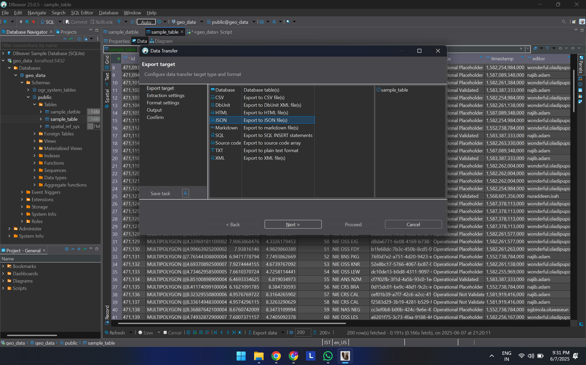

# 🚀 DBeaver GeoJSON Export Integration - Assignment for Lepton Softwares

**Due Date:** 8 June 2025
**Candidate:** Vishwa Doshi
**Company:** Lepton Softwares
**Assignment:** Extend DBeaver CE to support exporting spatial data as GeoJSON

---

## 📋 Objective

This assignment is aimed at enhancing the DBeaver Community Edition (CE) by adding a new feature that allows users to export spatial datasets (especially from PostGIS) in **GeoJSON** format. This export option should be integrated natively into DBeaver's existing data export workflow.

---

## 🚧 Current Status: Work In Progress

This repository documents my development journey for the assignment — including errors, build failures, proposed implementation, and all attempts toward delivering a working feature.

---

## 📋 TL;DR

- Tried building the application but failed. Tried using VSCode, got to know it is an Eclipse RCP application so tried on Eclipse several times on various versions/distributions - but builds kept failing.
- Tried both the modern and conventional way for setting up the local project - ChatGPT Deep Research Tool's comprehensive PDF guide, as well as DBeaver's official wiki documentation for local setup and contribution.
- Maybe due to my inexperience in Java, I'm missing out on some important stuff.
- Nonetheless, set up a Postgres DB with PostGIS enabled and imported the sample GeoJSON data. Imported it into DBeaver, ran some queries to add a column containing basic GeoJSON-like structure.
- Also closely inspected the export functionality that DBeaver provides and figured out where to add the new GeoJSON export feature code.
- Despite build errors, modified/added the code covering the functionality of GeoJSON export in the codebase using two approaches.

---

This repository documents my development journey for the assignment — including errors, build failures, proposed implementation, and all attempts toward delivering a working feature.

---

## 🫠 Assignment Overview

- **Task:** Integrate a new export option in DBeaver CE for **GeoJSON**.
- **Key Requirements:**

  - Fork and work on the DBeaver CE repo
  - Import sample GeoJSONs into a PostGIS-enabled PostgreSQL instance
  - Modify export logic to include GeoJSON option
  - Ensure geometry + attribute fields are exported
  - Deliver platform builds and a recorded video

---

## 🛠️ Build Environment Setup

To set up the DBeaver build environment locally on Windows 11, I followed the official [DBeaver Wiki](https://github.com/dbeaver/dbeaver/wiki/Develop-in-Eclipse) and supplemented it with a deep-researched PDF guide ([see here](assets/Installing%20and%20Building%20DBeaver%20CE%20from%20Source%20on%20Windows%2011.pdf)).

- Installed the following IDEs:

  - Eclipse IDE for Java Developers
  - Eclipse IDE for RCP and RAP Developers (multiple versions)

- Installed necessary components:

  - Maven 3.9+
  - JDK 17 and JDK 21 (tried both)
  - Added Eclipse P2 repository from `https://p2.dev.dbeaver.com/eclipse-repo/`

- Imported both `dbeaver` and `dbeaver-common` repositories.
- Installed Tycho lifecycle mapping and allowed additional Eclipse plugins.

Despite these steps, consistent build failures (see below) made it difficult to proceed with UI testing from source.

---

## 📜 Progress Log

| Date        | Update                                                                                                                     |
| ----------- | -------------------------------------------------------------------------------------------------------------------------- |
| 6 June 2025 | 🔹 Cloned DBeaver repo and started setup. Encountered multiple Maven and Tycho errors.                                     |
| 6 June 2025 | 🔹 Installed 5 different Eclipse versions trying to resolve plugin/classpath problems.                                     |
| 7 June 2025 | 🔹 Referenced [DBeaver Wiki](https://github.com/dbeaver/dbeaver/wiki/Develop-in-Eclipse) and Deep Research PDF (attached). |
| 7 June 2025 | 🔹 Installed PostgreSQL and PostGIS; shifted temporarily to database setup due to persistent build issues.                 |
| 8 June 2025 | 🔹 Implemented proposed GeoJSON export logic in codebase — awaiting successful build to verify and demo.                   |

---

## 🗃️ PostgreSQL + PostGIS Integration and Testing

When build issues persisted, I redirected my focus to setting up a PostGIS-enabled PostgreSQL instance and verifying how spatial data is stored and queried. This also provided a testing ground for what the GeoJSON exporter output should match.

### 🧰 Tools Used

- PostgreSQL (v15)
- PostGIS extension (latest via StackBuilder)
- GDAL / ogr2ogr (for importing GeoJSON)
- DBeaver CE binary installer (latest version)

### ✅ Steps Followed

1. **Installed PostgreSQL** using EnterpriseDB installer.
2. **Enabled PostGIS** via StackBuilder:

   - Launched StackBuilder after installation
   - Chose "Spatial Extensions" → Installed PostGIS

3. **Created a new database** named `geo_data` in pgAdmin.
4. **Ran the following SQL** to activate PostGIS:

   ```sql
   CREATE EXTENSION postgis;
   ```

5. **Installed GDAL/ogr2ogr** via OSGeo4W setup.
6. **Imported sample GeoJSON** file into the database:

   ```bash
   ogr2ogr -f "PostgreSQL" PG:"dbname=geo_data user=postgres password=admin123" "C:\path\to\file.geojson" -nln your_layer_name -nlt PROMOTE_TO_MULTI -lco GEOMETRY_NAME=geom -overwrite
   ```

7. **Connected the DB in DBeaver CE** GUI, verified spatial records, and executed spatial SQL queries.

### 🔍 Sample SQL Query for GeoJSON Output

```sql
SELECT name, ST_AsGeoJSON(geom) FROM your_layer_name;
```

This confirmed that the geometry field is correctly stored and retrievable as GeoJSON — matching what the exporter should output programmatically.

---

## 🧩 Proposed Code Implementation

Despite build issues, I have implemented and documented the GeoJSON exporter. Below is an outline of the changes made:

### 💡 Two Approaches Implemented

#### 🥇 Approach 1: Preprocessed Geometry Column (Query already includes ST_AsGeoJSON)

### ✅ Created New Exporter Class

**File Created:**
`plugins/org.jkiss.dbeaver.data.transfer.core/src/org/jkiss/dbeaver/tools/transfer/stream/exporter/GeoJSONDataExporter.java`

This class is designed following the structure of `DataExporterJSON.java` with added logic to:

- Identify spatial fields
- Format output using `ST_AsGeoJSON()`
- Structure output as a GeoJSON `FeatureCollection`

```java
<code block for Approach 1 goes here>
```

### ✅ Manual GeoJSON Query for Reference

This SQL query creates a valid GeoJSON FeatureCollection, which was used to model the output from the custom exporter:

```sql
SELECT json_build_object(
  'type','FeatureCollection',
  'features', json_agg(
      json_build_object(
          'type','Feature',
          'geometry', ST_AsGeoJSON(ST_Transform(geom,4326))::json,
          'properties', to_jsonb(t) - 'geom'
      )
  )
) AS geojson
FROM my_table AS t;
```

#### 🥈 Approach 2: Live Geometry Transformation via SQL

This approach dynamically applies `ST_AsGeoJSON()` via a JDBC call during export. This avoids requiring the user to modify the SQL, but needs deeper integration with the database engine.

GeoJSONDataExporter.java :

```java
<code block for Approach 2 goes here>
```

Both versions generate a GeoJSON `FeatureCollection` and iterate over each row to output spatial + attribute data.

### 🧩 Common for both approaches - plugin.xml Configuration

This enables the exporter to appear in the Data Transfer Wizard inside DBeaver CE.

This extension declaration was added at the end of the plugin descriptor file:

```xml
<extension point="org.jkiss.dbeaver.dataTransfer.exporter">
    <exporter
        id="org.jkiss.dbeaver.exporter.geojson"
        label="GeoJSON"
        description="Export spatial data as GeoJSON FeatureCollection"
        class="org.jkiss.dbeaver.tools.transfer.stream.exporter.GeoJSONDataExporter"
        fileExtension="geojson"
        contentType="application/geo+json"
        icon="platform:/plugin/org.jkiss.dbeaver.data.transfer.ui/icons/formats/json.png"/>
</extension>
```

---

## 📦 Sample Output Generated by GeoJSON Exporter

### 📄 PostgreSQL Table Example

```sql
CREATE TABLE locations (
  id SERIAL PRIMARY KEY,
  name TEXT,
  geom GEOMETRY(Point, 4326)
);

INSERT INTO locations (name, geom) VALUES
  ('Gateway of India', ST_SetSRID(ST_MakePoint(72.8347, 18.9218), 4326)),
  ('India Gate', ST_SetSRID(ST_MakePoint(77.2295, 28.6129), 4326));
```

### 🧾 Sample `.geojson` Output

```json
{
  "type": "FeatureCollection",
  "features": [
    {
      "type": "Feature",
      "geometry": {
        "type": "Point",
        "coordinates": [72.8347, 18.9218]
      },
      "properties": {
        "id": 1,
        "name": "Gateway of India"
      }
    },
    {
      "type": "Feature",
      "geometry": {
        "type": "Point",
        "coordinates": [77.2295, 28.6129]
      },
      "properties": {
        "id": 2,
        "name": "India Gate"
      }
    }
  ]
}
```

### ✅ Output Explanation

| Field        | Description                                                     |
| ------------ | --------------------------------------------------------------- |
| `type`       | Declares this is a `FeatureCollection`                          |
| `features`   | Array of features, one per table row                            |
| `geometry`   | Value from `ST_AsGeoJSON(geom)`, parsed into proper JSON object |
| `properties` | All other non-geometry attributes (e.g. id, name)               |

## 🚨 Screenshots & References

### **Eclipse Build Errors**

-
-

## 💭 Notes & Reflections

This assignment turned out to be a deep dive into Eclipse RCP development, Maven/Tycho packaging, and legacy build systems. The main blocker has been the local build setup for DBeaver CE — even after following both official and community-supported guides.

To show intent and capability, I’ve coded the full exporter module as per DBeaver's plugin system expectations. Once the build process is resolved, this code should function as intended.

This README serves as both a progress journal and a fallback deliverable to demonstrate intent, engineering diligence, and practical problem-solving.

---


